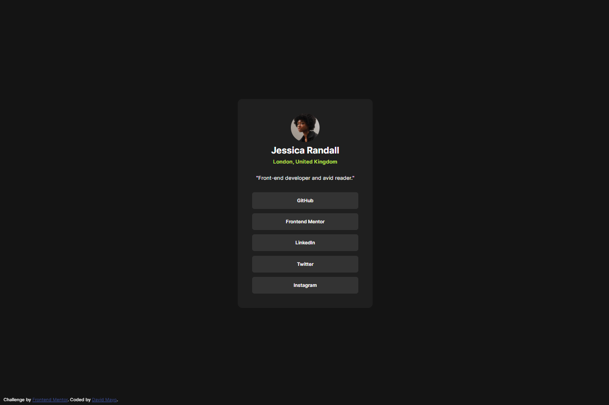
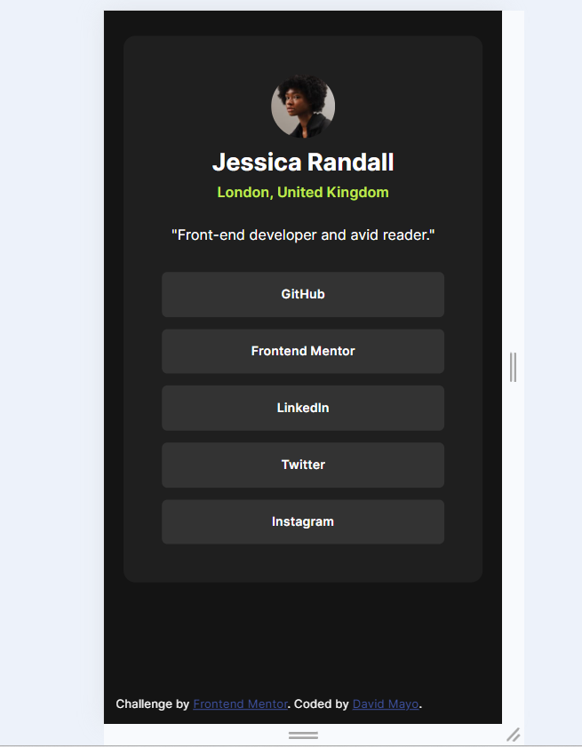

# Frontend Mentor - Social links profile solution

This is a solution to the [Social links profile challenge on Frontend Mentor](https://www.frontendmentor.io/challenges/social-links-profile-UG32l9m6dQ). Frontend Mentor challenges help you improve your coding skills by building realistic projects. 

## Table of contents

- [Overview](#overview)
  - [The challenge](#the-challenge)
  - [Screenshot](#screenshot)
  - [Links](#links)
- [My process](#my-process)
  - [Built with](#built-with)
  - [What I learned](#what-i-learned)
  - [Continued development](#continued-development)
- [Author](#author)


## Overview

### The challenge

Users should be able to:

- See hover and focus states for all interactive elements on the page
- Responsive for mobile devices

### Screenshot




### Links

- Solution URL: [Github repository](https://github.com/damayor/fm-blog-preview-card)
- Live Site URL: [Guthub Pages](https://damayor.github.io/fm-blog-preview-card/)

## My process

### Built with

- Semantic HTML5 markup
- CSS custom properties
- Flexbox and Grid
- React
- Data component to save social media links

### What I learned

I went through the main principles of React to create a component that will be reused in this case, into a grid of buttons.
In this case was a real challenge to develop without a Figma project. I increased to measure pixels and colors just with a pair of sample images

```js
const SocialButton = ({textLabel, url = '#'}) => (
  <div tabIndex={0} className="social-button" onClick={() => window.open(url, "_blank")}>
      {textLabel}
  </div>
)
```

### Continued development

- Prompt out the sample project. Update with my real data on the visual side, adding my own style.s

## Author

- Website - [David Mayo](https://davidmayorgah.wixsite.com/visualcv?lang=en)
- Frontend Mentor - [@yourusername](https://www.frontendmentor.io/profile/damayor)
- Twitter - [@yourusername](https://www.twitter.com/damayor11)

